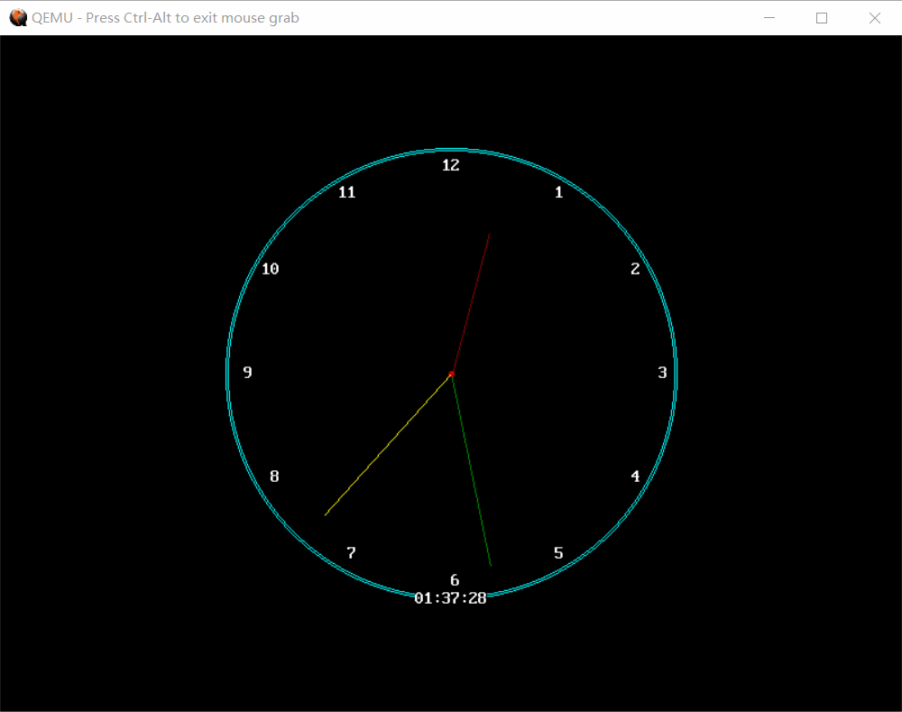
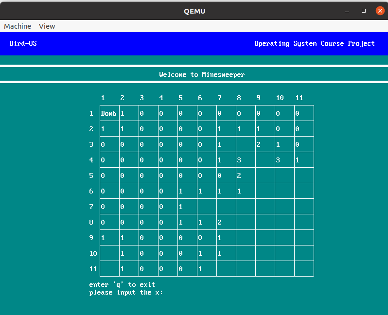

# OS

> 同济大学软件学院 - 操作系统课程项目
>
> 利用C语言，汇编实现的简易操作系统    

## 实现功能

- 系统级

  - 重新实现引导扇区
  - 多级文件目录
  - 图形化系统
  - 进程管理
  - 多级队列调度

- 用户级
  
  - 游戏：2048、扫雷、贪吃蛇、推箱子、计时器、计算器、日历、五子棋等
  
- 部分功能截图，更多截图见文档`./docs/os项目说明文档.docx`





## 运行

### 环境配置

```shell
$ sudo apt install -y gcc gcc-multilib nasm qemu-system-x86 gdb
$ touch ~/.gdbinit
$ echo "set auto-load safe-path /" > ~/.gdbinit
```

### 启动模拟器

```shell
$ make qemu
```
> 在随后打开的gdb中输入c启动系统

## 联系方式

PS：如有<span title="tongji">`tj`</span>学妹需要嫖本项目且有疑问的，请联系qq1360733438、qq1455670697 \*\^\_\^\*
